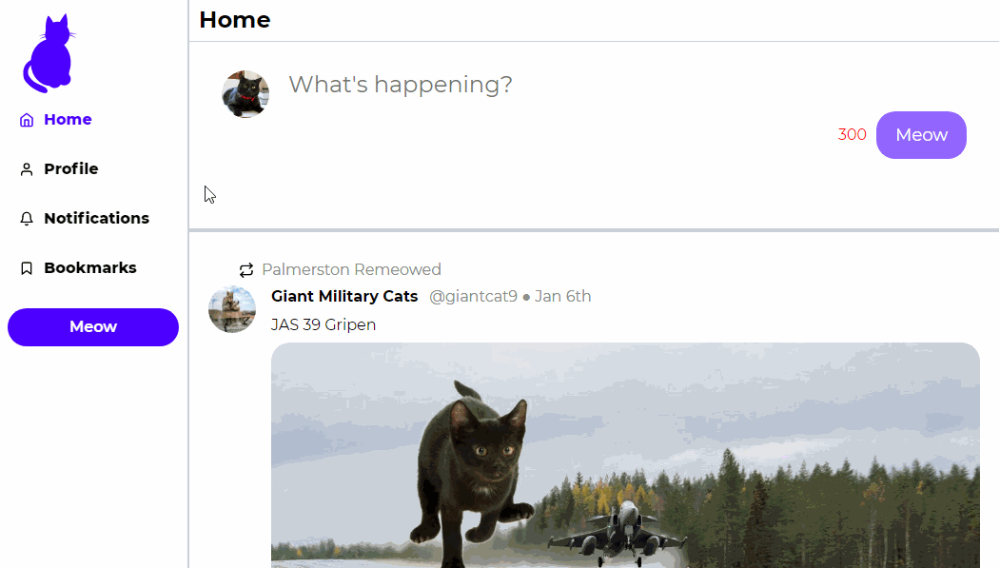
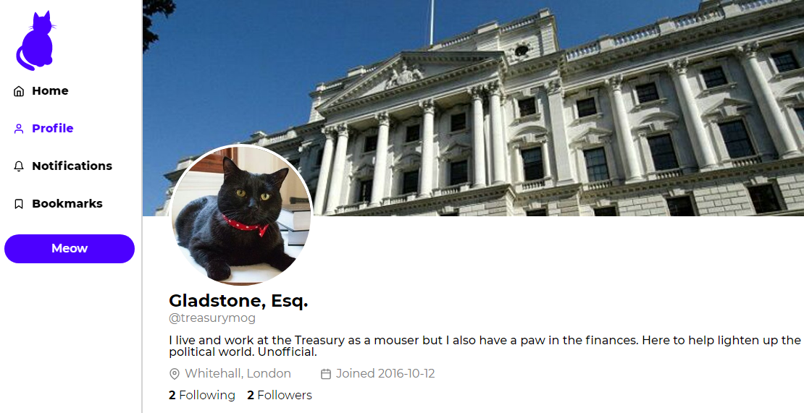
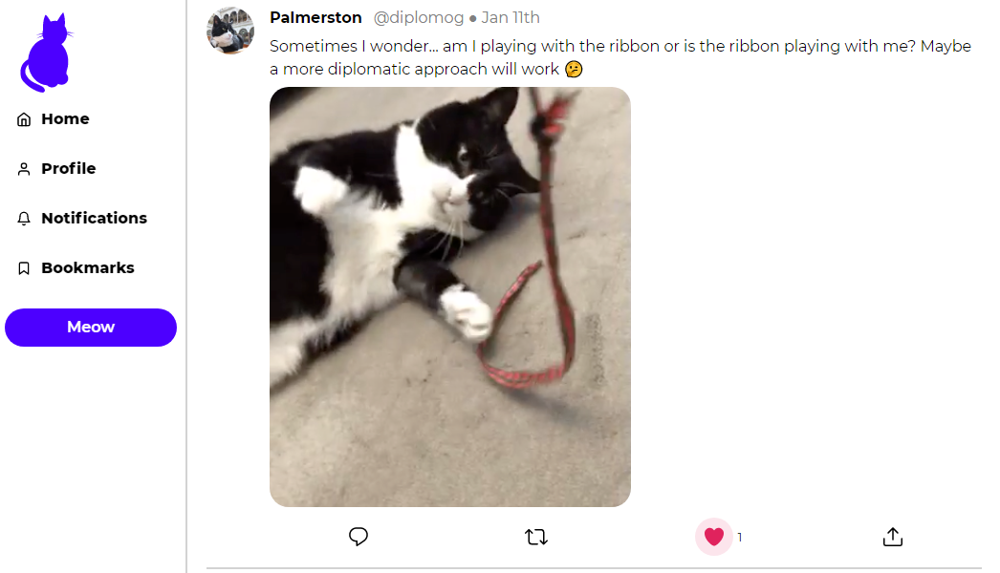

# Twitter Clone : Critter

---

## Task Description

Create a functioning twitter clone using the provided data and API.

## Tech

React.js
Node.js
Express

---

---

## Features

- View single tweet
- View home feed
- View profile page
- Like a tweet
- Post a tweet

---

---

## Instructions

In order to run the app:

> yarn start from client folder ||
> yarn start:server in server folder
